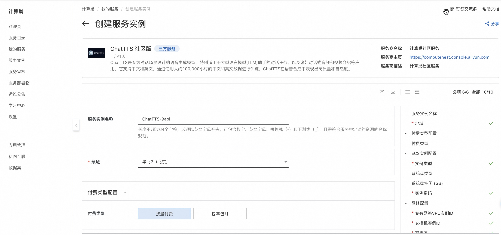
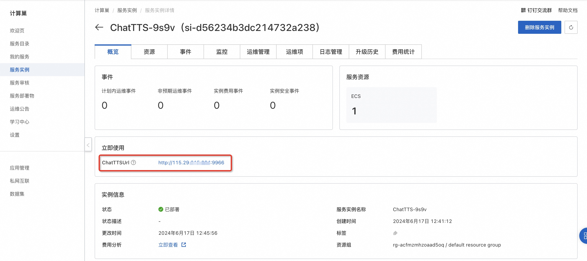
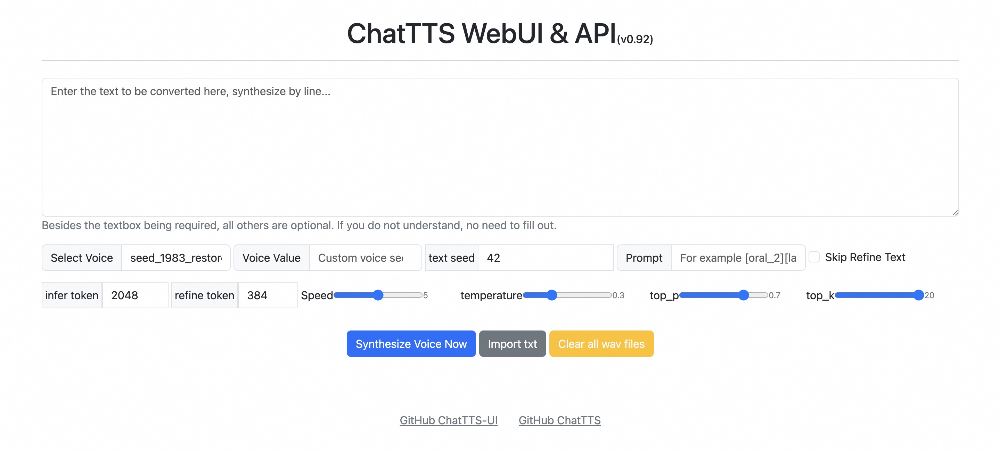

# 快速部署 ChatTTS 社区版

## 概述

ChatTTS是专为对话场景设计的语音生成模型，特别适用于大型语言模型(LLM)助手的对话任务，以及诸如对话式音频和视频介绍等应用。它支持中文和英文，通过使用大约100,000小时的中文和英文数据进行训练，ChatTTS在语音合成中表现出高质量和自然度。

ChatTTS官方网站：[https://chattts.com/](https://chattts.com/)

## 计费说明

ChatTTS在计算巢上的费用主要涉及：

- 所选vCPU与内存规格
- 磁盘容量
- 公网带宽

计费方式：按量付费（小时）

预估费用在创建实例时可实时看到。

## 部署架构

ChatTTS社区版是单机部署架构。

## RAM账号所需权限

ChatTTS服务需要对ECS、VPC等资源进行访问和创建操作，若您使用RAM用户创建服务实例，需要在创建服务实例前，对使用的RAM用户的账号添加相应资源的权限。添加RAM权限的详细操作，请参见[为RAM用户授权](https://help.aliyun.com/document_detail/121945.html)
。所需权限如下表所示。

| 权限策略名称                          | 备注                         |
|---------------------------------|----------------------------|
| AliyunECSFullAccess             | 管理云服务器服务（ECS）的权限           |
| AliyunVPCFullAccess             | 管理专有网络（VPC）的权限             |
| AliyunROSFullAccess             | 管理资源编排服务（ROS）的权限           |
| AliyunComputeNestUserFullAccess | 管理计算巢服务（ComputeNest）的用户侧权限 |
| AliyunCloudMonitorFullAccess    | 管理云监控（CloudMonitor）的权限     |

## 部署流程

1. 单击[部署链接](https://computenest.console.aliyun.com/service/instance/create/cn-hangzhou?type=user&ServiceId=service-661348ba42bf469182de)，进入服务实例部署界面。
2. 选择新建ECS实例并根据界面提示配置参数，配置完成后点击下一步：确认订单。

    
   
3. 点击立即创建，等待服务实例创建完成。

   

4. 服务实例创建成功后，进入服务实例详情页。在概览页可获取ChatTTS登录信息。
   
   

5. 点击外网面板地址访问ChatTTS服务。
   
   